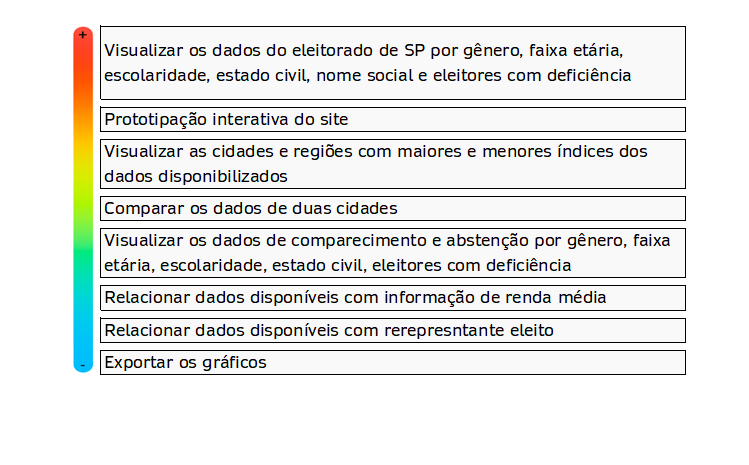

## Apresentação

Somos alunos do 1º semestre (2021-1) do curso Desenvolvimento de Software Multiplataforma da Fatec São José dos Campos - Prof. Jessen Vidal.  
 

Equipe | |  | |
:--------- | :------: | :-------: | :-------:
Gabriel Camargo Leite | DT | [Linkedin](https://www.linkedin.com/in/gabriel-camargo-915452196/) | [Github](https://github.com/GabrielCamargoL)
João Marcos Oliveira Santos | DT | [Linkedin](https://www.linkedin.com/in/joaomarcosoliveiraa/) |  [Github](https://github.com/JoaoM-py)
Luiz Fernando Moloni | DT | [Linkedin](https://www.linkedin.com/in/luiz-fernando-moloni-ab9021204/) | [Github](https://github.com/FernandoGT3)
Monique Carniello | SM | [Linkedin](https://www.linkedin.com/in/monique-carniello-511ba61b6/) | [Github](https://github.com/Monique-c)
Otavio Ferraroni G Pane | DT | [Linkedin](https://www.linkedin.com/in/otavioferraronigpane)| [Github](https://github.com/OtavioPane)
Rafael Roberto Lopes | DT | [Linkedin](https://www.linkedin.com/in/rafael-roberto-lopes/) | [Github](https://github.com/Rafael-Faioli)
Thiago Henrique Ferreira | DT | [Linkedin](https://www.linkedin.com/in/thiago-henrique-ferreira-2499a41a8/) | [Github](https://github.com/ThHenrique)   
  

`DT - Developers Team`  
`SM - Scrum Master`  
 
 
 

## Objetivo

Utilizando de metodologia ágil, desenvolver um site com análise de dados públicos, focando no eleitorado do Estado de São Paulo, com uma linguagem familiar ao cliente (Python) e que demonstre os dados também através de gráficos e porcentagens
 
 
## Bases de dados:

- [Eleitorado](https://www.tse.jus.br/eleicoes/estatisticas/repositorio-de-dados-eleitorais-1)   
Página inicial > eleitorado > atual > perfil eleitorado por seção atual > São Paulo

- [Comparecimento e abstenção](https://www.tse.jus.br/eleicoes/estatisticas/repositorio-de-dados-eleitorais-1)  
Página inicial > Comparecimento e Abstenção > 2016     
Página inicial > Comparecimento e Abstenção > 2018  
Página inicial > Comparecimento e Abstenção > 2020  

- [Renda](https://geoservicos.ibge.gov.br/geoserver/CGEO/ows?service=WFS&version=1.0.0&request=GetFeature&typeName=CGEO:vw_pib_percapita&outputFormat=csv)  
O arquivo será baixado ao clicar no link
 
 

## Tecnologias utilizadas no desenvolvimento

  

 
 

## Product Backlog

 
 

## User Stories

<h5> 1. Como jornalista quero saber a quantidade de eleitores por faixa etária do Estado de São Paulo e de cada uma de suas cidades, para utilizar esses dados em reportagens<h5>
<h5> 2. Como jornalista quero saber o estado civil dos eleitores do Estado de São Paulo e de cada uma de suas cidades, para utilizar esses dados em reportagens<h5>
<h5> 3.	Como jornalista quero saber a escolaridade declarada dos eleitores do Estado de São Paulo e de cada uma de suas cidades, para utilizar esses dados em reportagens<h5>
<h5> 4.	Como jornalista quero saber a quantidade de eleitores que solicitaram inclusão de nome social, do Estado de São Paulo e de cada uma de suas cidades, para utilizar esses dados em reportagens<h5>
<h5> 5.	Como jornalista quero poder comparar os dados de uma categoria (exemplo: escolaridade) entre duas cidades selecionadas, para utilizá-los em reportagens<h5>
<h5> 6.	Como jornalista quero saber as cidades que têm o maior e menor índice de determinada categoria (exemplo: qual cidade tem mais eleitores jovens e qual tem menos), para esses dados em reportagens<h5>
<h5> 7.	Como jornalista quero saber a renda média das cidades e regiões do Estado de São Paulo, para utilizar esses dados em reportagens<h5>
<h5> 8.	 Como jornalista quero comparar a renda média de duas cidades ou regiões selecionadas, para utilizar esses dados em reportagens<h5>
<h5> 9.	 Como jornalista quero saber qual cidade tem a maior e qual tem a menor renda média, para utilizar esses dados em reportagens<h5>
<h5> 10.	 Como jornalista quero saber a quantidade de eleitores, por faixa etária, que compareceram e que não compareceram na eleição 2020, do Estado de São Paulo e de cada uma de suas cidades, para utilizar esses dados em reportagens<h5>
<h5> 11.	 Como jornalista quero saber o a quantidade de eleitores, por estado civil, que compareceram e que não compareceram na eleição 2020, do Estado de São Paulo e de cada uma de suas cidades, para utilizar esses dados em reportagens<h5>
<h5> 12.	 Como jornalista quero saber a quantidade de eleitores, por escolaridade declarada, que compareceram e que não compareceram na eleição 2020, do Estado de São Paulo e de cada uma de suas cidades, para utilizar esses dados em reportagens<h5>
<h5> 13.	Como jornalista quero poder comparar os dados de abstenção/comparecimento de uma categoria (exemplo: escolaridade) entre duas cidades selecionadas, para utilizá-los em reportagens<h5>
<h5> 14.	 Como jornalista quero saber as cidades que têm o maior e menor índice de comparecimento e abstenção de determinada categoria para utilizá-los em reportagens<h5>
<h5> 15.	 Como jornalista quero poder relacionar o representante eleito de uma cidade com outros índices disponibilizados, para utilizar esses dados em reportagens<h5>
<h5>16.	 Como jornalista gostaria de poder automatizar a publicação de gráficos em diferentes plataformas, de maneira que possam ser utilizadas em TV, na internet, em newsletter, etc, para utilizar esses dados em reportagens<h5>

 
 
 

# Sprints

### Sprint 01 - 08/03/2021 a 28/03/2021

Durante a primeira entrega, grande parte do esforço foi concentrado em pesquisas, planejamento e também na elaboração de um protótipo interativo do site. Além disso, iniciamos o desenvolvimento da homepage e da página de perfil do eleitorado.

Sprint Backlog | Esforço | Entrega | |
:--------- | :------: | :-------: | :-------:
Levantamento requisitos | 13 | |
Pesquisa | 20 | |
Homepage e página de eleitorado - frontend | 8 |[Vídeo](https://youtu.be/Yx8WpT7ADQs) / [Repositório](https://github.com/fa-API-Group-02/web) ||
Protótipo interativo do site (Figma) | 13 | [Protótipo](https://www.figma.com/proto/UVEmw6ey4058ZKu0a9DaWu/FA-API-dados_eleitorais?node-id=275%3A222&scaling=scale-down-width&page-id=0%3A1) |
Demonstração do protótipo | 5 |[Vídeo](https://youtu.be/KQw8BBUtF6M) | | 
 

### Sprint 02 - 29/03/2021 a 18/04/2021
Para essa sprint, devido à uma priorização do cliente, desenvolvemos back end em Python, fazendo uso de suas bibliotecas Pandas, Numpy e Matplotlib, e do ambiente Jupyter Notebook 

Sprint Backlog | Esforço | Entrega | |
:--------- | :------: | :-------: | :-------:
Homepage - incrementação  | 5 | |
Páginas Eleitorado, Comparecimento e Renda - frontend | 13 | |
Jupyter Notebook do Eleitorado - pesquisa | 13 | ||
Jupyter Notebook do Comparecimento e Abstenção - pesquisa | 13 | |
Jupyter Notebook de Renda - pesquisa| 13 | | |
Jupyter Notebook do Eleitorado - pesquisa | 13 | ||
Jupyter Notebook do Comparecimento e Abstenção - pesquisa | 13 | |
Jupyter Notebook de Renda - pesquisa| 13 | | | 
 

### Sprint 03 - 26/04/2021 a 16/05/2021

Sprint Backlog | Esforço | Entrega | |
:--------- | :------: | :-------: | :-------:
Levantamento requisitos | 13 | |
Pesquisa | 20 | |
Homepage e página de eleitorado - frontend | 8 |[Vídeo](https://youtu.be/Yx8WpT7ADQs) / [Repositório](https://github.com/fa-API-Group-02/web) ||
Protótipo interativo do site (Figma) | 13 | [Protótipo](https://www.figma.com/proto/UVEmw6ey4058ZKu0a9DaWu/FA-API-dados_eleitorais?node-id=275%3A222&scaling=scale-down-width&page-id=0%3A1) |
Demonstração do protótipo | 5 |[Vídeo](https://youtu.be/KQw8BBUtF6M) | | 
 

### Sprint 04 - 17/05/2021 a 05/06/2021

Sprint Backlog | Esforço | Entrega | |
:--------- | :------: | :-------: | :-------:
Levantamento requisitos | 13 | |
Pesquisa | 20 | |
Homepage e página de eleitorado - frontend | 8 |[Vídeo](https://youtu.be/Yx8WpT7ADQs) / [Repositório](https://github.com/fa-API-Group-02/web) ||
Protótipo interativo do site (Figma) | 13 | [Protótipo](https://www.figma.com/proto/UVEmw6ey4058ZKu0a9DaWu/FA-API-dados_eleitorais?node-id=275%3A222&scaling=scale-down-width&page-id=0%3A1) |
Demonstração do protótipo | 5 |[Vídeo](https://youtu.be/KQw8BBUtF6M) | | 
 