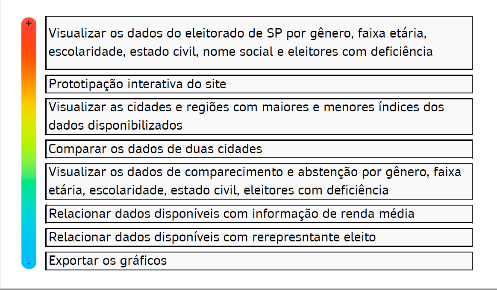
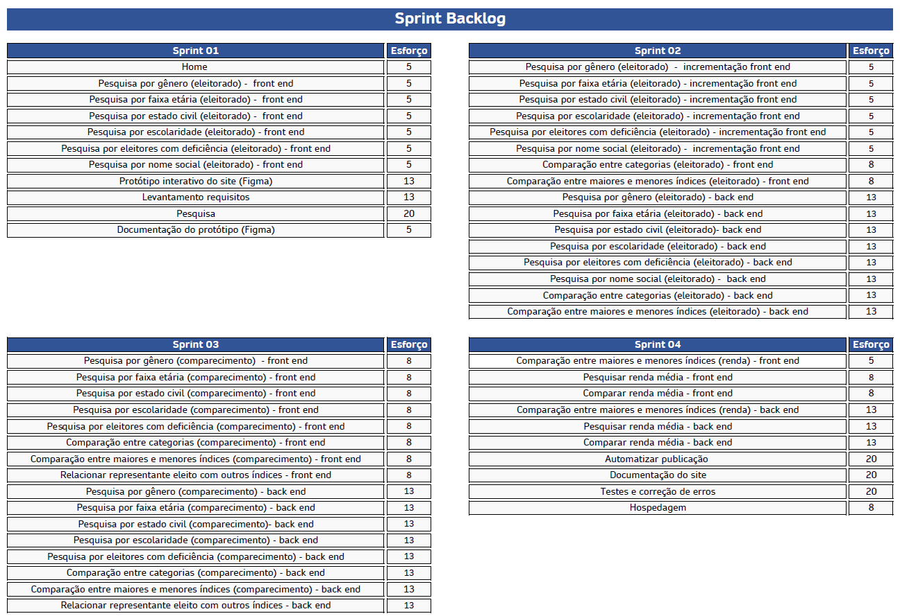

## Apresentação

Somos alunos do 1º semestre (2021-1) do curso Desenvolvimento de Software Multiplataforma da Fatec São José dos Campos - Prof. Jessen Vidal.
O grupo 02 é formado por:

- [Gabriel Camargo Leite - DT](https://www.linkedin.com/in/gabriel-camargo-915452196/)
- [João Marcos Oliveira Santos - DT](https://www.linkedin.com/in/joaomarcosoliveiraa/)
- [Luis Fernando Moloni - DT](https://www.linkedin.com/in/luiz-fernando-moloni-ab9021204/)
- [Luiz Guilherme Florido - DT](https://www.google.com/)
- [Monique Carniello - SM](https://www.linkedin.com/in/monique-carniello-511ba61b6/)
- [Otavio Ferraroni G Pane - DT](https://www.linkedin.com/in/otavioferraronigpane)
- [Rafael Roberto Lopes - DT](https://www.linkedin.com/in/rafael-roberto-lopes/)
- [Thiago Henrique Ferreira - DT](https://www.linkedin.com/in/thiago-henrique-ferreira-2499a41a8/)

`SM - Scrum Master`
`DT - Developers Team`
 
 
 
## Objetivo

Desenvolver um site para análise de dados públicos, com foco no eleitorado do estado de São Paulo, com uma linguagem familiar ao cliente (Python) e que demonstre os dados também através de gráficos e porcentagens

Bases de dados:

- [Eleitorado](https://www.tse.jus.br/eleicoes/estatisticas/repositorio-de-dados-eleitorais-1)
- [Comparecimento e abstenção](https://www.tse.jus.br/eleicoes/estatisticas/repositorio-de-dados-eleitorais-1)
- [Renda média](https://www.tse.jus.br/eleicoes/estatisticas/repositorio-de-dados-eleitorais-1)
 
 
 
## Tecnologias utilizadas no desenvolvimento

 
 
 

## Product Backlog

 
 
 

## User Stories

1.	Como jornalista quero saber a quantidade de eleitores de cada gênero do Estado de São Paulo e de cada uma de suas cidades, para utilizar esses dados em reportagens
2.	Como jornalista quero saber a quantidade de eleitores por faixa etária do Estado de São Paulo e de cada uma de suas cidades, para utilizar esses dados em reportagens
3.	Como jornalista quero saber o estado civil dos eleitores do Estado de São Paulo e de cada uma de suas cidades, para utilizar esses dados em reportagens
4.	Como jornalista quero saber a escolaridade declarada dos eleitores do Estado de São Paulo e de cada uma de suas cidades, para utilizar esses dados em reportagens
5.	Como jornalista quero saber a quantidade de eleitores com deficiência, do Estado de São Paulo e de cada uma de suas cidades, para utilizar esses dados em reportagens
6.	Como jornalista quero saber a quantidade de eleitores que solicitaram inclusão de nome social, do Estado de São Paulo e de cada uma de suas cidades, para utilizar esses dados em reportagens
7.	Como jornalista quero poder comparar os dados de uma categoria (exemplo: gênero) entre duas cidades selecionadas, para utilizá-los em reportagens
8.	Como jornalista quero saber as cidades que têm o maior e menor índice de determinada categoria (exemplo: qual cidade tem mais eleitores com deficiência e qual tem menos), para esses dados em reportagens
9.	Como jornalista quero saber a quantidade de eleitores, por gênero, que compareceram e que não compareceram na eleição 2020, do Estado de São Paulo e de cada uma de suas cidades, para utilizar esses dados em reportagens
10.	Como jornalista quero saber a renda média das cidades e regiões do Estado de São Paulo, para utilizar esses dados em reportagens
11.	 Como jornalista quero comparar a renda média de duas cidades ou regiões selecionadas, para utilizar esses dados em reportagens
12.	 Como jornalista quero saber qual cidade tem a maior e qual tem a menor renda média, para utilizar esses dados em reportagens
13.	 Como jornalista quero saber a quantidade de eleitores, por faixa etária, que compareceram e que não compareceram na eleição 2020, do Estado de São Paulo e de cada uma de suas cidades, para utilizar esses dados em reportagens
14.	 Como jornalista quero saber o a quantidade de eleitores, por estado civil, que compareceram e que não compareceram na eleição 2020, do Estado de São Paulo e de cada uma de suas cidades, para utilizar esses dados em reportagens
15.	 Como jornalista quero saber a quantidade de eleitores, por escolaridade declarada, que compareceram e que não compareceram na eleição 2020, do Estado de São Paulo e de cada uma de suas cidades, para utilizar esses dados em reportagens
16.	 Como jornalista quero saber a quantidade de eleitores com deficiência que compareceram e que não compareceram na eleição 2020, do Estado de São Paulo e de cada uma de suas cidades, para utilizar esses dados em reportagens
17.	 Como jornalista quero poder comparar os dados de abstenção/comparecimento de uma categoria (exemplo: gênero) entre duas cidades selecionadas, para utilizá-los em reportagens
18.	 Como jornalista quero saber as cidades que têm o maior e menor índice de comparecimento e abstenção de determinada categoria (exemplo: em qual cidade mais pessoas com deficiência faltaram e em qual mais compareceram), para utilizá-los em reportagens
19.	 Como jornalista quero poder relacionar o representante eleito de uma cidade com outros índices disponibilizados, para utilizar esses dados em reportagens
20.	 Como jornalista gostaria de poder automatizar a publicação de gráficos em diferentes plataformas, de maneira que possam ser utilizadas em TV, na internet, em newsletter, etc, para utilizar esses dados em reportagens
 
 
 

## Sprint Backlog

 
 
 

## Sprints

[Sprint 1 - 08/09/2021 a 28/03/2021](https://github.com/fa-API-Group-02/project/tree/main/Sprint-01)

[Sprint 02 - 29/03/2021 a 18/04/2021](https://github.com/fa-API-Group-02/project/tree/main/Sprint-02)

[Sprint 03 - 26/04/2021 a 16/05/2021](https://github.com/fa-API-Group-02/project/tree/main/Sprint-03)

[Sprint 04 - 17/05/2021 a 05/06/2021](https://github.com/fa-API-Group-02/project/tree/main/Sprint-04)
